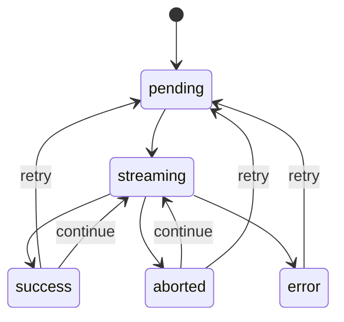

# 企业级 AI 对话前端：停止生成、重试、继续生成如何实现

## 一、核心理解

停止生成、重试、继续生成，本质上都是围绕一次 AI 生成请求的生命周期管理。

| 能力 | 核心动作 | 关键状态 |
| --- | --- | --- |
| 停止生成 | 中断当前流式请求，并保留已生成内容 | `streaming -> aborted` |
| 重试 | 基于上一条用户消息和原始上下文重新生成 | `error/aborted/success -> pending -> streaming` |
| 继续生成 | 基于当前 assistant 已有内容继续向后生成 | `aborted/success -> streaming` |

这三个能力不要只当成按钮交互处理，而应该落到统一的消息模型、请求模型和状态机里。

核心字段通常包括：

```ts
interface ChatMessage {
  id: string;
  conversationId: string;
  role: 'user' | 'assistant' | 'system' | 'tool';
  content: string;
  status: 'pending' | 'streaming' | 'success' | 'error' | 'aborted';
  requestId?: string;
  parentId?: string;
  retryOfMessageId?: string;
  error?: {
    code: string;
    message: string;
    retryable: boolean;
  };
}
```

其中：

- `messageId` 用来定位被更新的消息。
- `requestId` 用来区分每一次生成请求。
- `status` 用来驱动 UI 状态和可用操作。
- `parentId` / `retryOfMessageId` 用来支持重试版本或分支回答。

## 二、停止生成

### 1. 前端如何停止

前端通常使用 `AbortController` 中断当前流式请求。

```ts
let currentAbortController: AbortController | null = null;

async function sendMessage(content: string) {
  const controller = new AbortController();
  currentAbortController = controller;

  try {
    const res = await fetch('/api/chat/stream', {
      method: 'POST',
      body: JSON.stringify({ content }),
      signal: controller.signal,
    });

    const reader = res.body!.getReader();

    while (true) {
      const { done, value } = await reader.read();
      if (done) break;

      const chunk = new TextDecoder().decode(value);
      appendAssistantContent(chunk);
    }

    markMessageSuccess();
  } catch (err: any) {
    if (err.name === 'AbortError') {
      markMessageAborted();
    } else {
      markMessageError(err);
    }
  } finally {
    currentAbortController = null;
  }
}

function stopGeneration() {
  currentAbortController?.abort();
}
```

停止生成后，不建议删除 assistant 消息，而是保留已经生成的半截内容：

```ts
{
  role: 'assistant',
  content: '已经生成的部分内容...',
  status: 'aborted'
}
```

UI 上可以展示：

- 已停止
- 继续生成
- 重新生成

### 2. 为什么还需要服务端 cancel

`AbortController` 只能中断浏览器和服务端之间的连接，不一定能真正停止服务端正在进行的模型推理或工具调用。

所以企业级场景最好提供取消接口：

```http
POST /api/chat/requests/:requestId/cancel
```

停止时前端同时做两件事：

```ts
function stopGeneration() {
  currentAbortController?.abort();

  if (currentRequestId) {
    cancelRequest(currentRequestId);
  }
}
```

服务端收到取消请求后应该：

- 停止模型流式生成。
- 停止未完成的工具调用。
- 标记请求为 `cancelled`。
- 记录已消耗 token。
- 写入审计日志。

否则前端虽然停了，服务端可能还在继续消耗模型资源。

## 三、重试

### 1. 重试的两种产品语义

重试通常有两种实现方式：

| 方式 | 说明 | 适用场景 |
| --- | --- | --- |
| 替换原回答 | 清空原 assistant 内容，重新生成 | 普通聊天产品 |
| 新增回答版本 | 保留旧回答，生成一个新版本 | 企业审计、多版本对比 |

企业级 AI 对话更推荐服务端保留历史版本，前端可以只展示最新版本。

```ts
interface ChatMessage {
  id: string;
  parentId?: string;
  retryOfMessageId?: string;
  version?: number;
}
```

### 2. 前端重试流程

重试不是简单拿当前 assistant 内容再发一遍，而是找到它对应的上一条 user message，然后基于原始上下文重新生成。

```ts
async function retryMessage(assistantMessageId: string) {
  const assistantMessage = findMessage(assistantMessageId);
  const userMessage = findPreviousUserMessage(assistantMessageId);

  updateMessage(assistantMessageId, {
    content: '',
    status: 'pending',
    error: undefined,
  });

  await regenerate({
    userMessageId: userMessage.id,
    assistantMessageId,
  });
}
```

请求可以设计成：

```http
POST /api/chat/messages/:messageId/retry
```

请求体：

```json
{
  "conversationId": "conv_1",
  "retryOfMessageId": "msg_assistant_1",
  "parentUserMessageId": "msg_user_1",
  "stream": true
}
```

### 3. 为什么重试不要只传文本

企业场景里，一次 AI 生成可能依赖很多上下文：

- 当时选择的模型。
- 当时选择的知识库。
- 上传的附件。
- 业务对象上下文。
- Prompt 版本。
- 用户权限。
- 工具调用结果。

所以重试最好让服务端基于 `messageId` 还原原始上下文，而不是前端只传一段用户输入文本。

这样可以保证：

- 重试结果可追踪。
- 审计链路完整。
- 权限和知识库上下文不丢失。
- 未来支持分支对话和版本对比。

## 四、继续生成

### 1. 继续生成的语义

继续生成不是重新回答，而是基于当前 assistant 已有内容继续向后生成。

也就是说：

| 行为 | 是否保留原内容 | 生成方式 |
| --- | --- | --- |
| 重试 | 通常不保留原内容 | 从原 user message 重新开始 |
| 继续生成 | 保留原内容 | 从当前 assistant 内容后面续写 |
| 停止生成 | 保留已生成内容 | 中断当前请求 |

一句话总结：

> 停止是中断当前请求，重试是重新回答一遍，继续生成是沿着已有回答往后补。

### 2. 前端继续生成流程

前端可以把当前 assistant 消息 ID 传给服务端，由服务端恢复上下文并继续生成。

```ts
async function continueGeneration(assistantMessageId: string) {
  const message = findMessage(assistantMessageId);

  updateMessage(assistantMessageId, {
    status: 'streaming',
  });

  await fetchStream('/api/chat/continue', {
    conversationId: message.conversationId,
    assistantMessageId: message.id,
    currentContent: message.content,
  });
}
```

接口可以设计成：

```http
POST /api/chat/messages/:messageId/continue
```

请求体：

```json
{
  "conversationId": "conv_1",
  "stream": true
}
```

服务端根据 `messageId` 找到：

- 原始 user message。
- 当前 assistant 已生成内容。
- 会话历史。
- 模型参数。
- RAG 上下文。
- 工具调用上下文。

然后继续生成。

前端收到流式 chunk 后，继续 append 到原 assistant 消息后面：

```ts
appendMessageContent(assistantMessageId, chunk);
```

### 3. 追加到原消息还是新增一条消息

继续生成有两种展示方式：

| 方式 | 体验 | 建议 |
| --- | --- | --- |
| 追加到原 assistant 消息 | 更像一条完整回答 | 推荐 |
| 新增一条 assistant 消息 | 更容易保留生成阶段 | 适合强审计场景 |

大多数对话产品里，继续生成追加到同一条 assistant 消息更自然。

## 五、统一状态机

可以把三种行为统一抽象为一个消息状态机：



不同状态下展示不同按钮：

| 当前状态 | 可展示操作 |
| --- | --- |
| `pending` | 取消 |
| `streaming` | 停止生成 |
| `aborted` | 继续生成、重新生成 |
| `error` | 重试 |
| `success` | 重新生成、继续生成 |

## 六、流式请求一致性

### 1. 为什么需要 requestId

流式响应里最容易出问题的是旧请求污染新消息，比如：

- 用户点击停止后，旧请求还有 chunk 返回。
- 用户点击重试后，旧请求继续写入新回答。
- 用户切换会话后，旧流继续更新当前页面。
- 网络延迟导致响应晚到。

所以每一次生成请求都必须有 `requestId`。

```ts
function appendChunk(params: {
  conversationId: string;
  messageId: string;
  requestId: string;
  chunk: string;
}) {
  const message = getMessage(params.messageId);

  if (!message) return;

  if (message.requestId !== params.requestId) {
    return;
  }

  message.content += params.chunk;
}
```

### 2. 推荐校验维度

流式 chunk 到达时，至少校验：

- `conversationId`
- `messageId`
- `requestId`
- 当前消息是否仍处于 `streaming`

示例：

```ts
function canApplyChunk(params: {
  conversationId: string;
  messageId: string;
  requestId: string;
}) {
  const message = getMessage(params.messageId);

  return (
    message &&
    message.conversationId === params.conversationId &&
    message.requestId === params.requestId &&
    message.status === 'streaming'
  );
}
```

## 七、前端 Store 设计

可以把生成相关状态单独收敛到 store 中。

```ts
interface ChatGenerationState {
  activeRequestId?: string;
  activeMessageId?: string;
  abortController?: AbortController;
  status: 'idle' | 'pending' | 'streaming';
}

interface ChatActions {
  sendMessage(content: string): Promise<void>;
  stopGeneration(): Promise<void>;
  retryMessage(messageId: string): Promise<void>;
  continueGeneration(messageId: string): Promise<void>;
}
```

如果只支持单会话单请求，可以维护一个全局 `activeRequestId`。

如果支持多个会话后台同时生成，则应该按 `conversationId` 维护：

```ts
type GenerationMap = Record<
  string,
  {
    requestId: string;
    messageId: string;
    abortController: AbortController;
    status: 'pending' | 'streaming';
  }
>;
```

## 八、接口设计参考

### 1. 创建流式生成

```http
POST /api/chat/conversations/:conversationId/messages
```

```json
{
  "content": "帮我分析这个需求",
  "model": "gpt-4.1",
  "knowledgeBaseIds": ["kb_1"],
  "attachmentIds": ["file_1"],
  "stream": true
}
```

### 2. 停止生成

```http
POST /api/chat/requests/:requestId/cancel
```

### 3. 重试

```http
POST /api/chat/messages/:messageId/retry
```

```json
{
  "conversationId": "conv_1",
  "stream": true
}
```

### 4. 继续生成

```http
POST /api/chat/messages/:messageId/continue
```

```json
{
  "conversationId": "conv_1",
  "stream": true
}
```

### 5. SSE 事件示例

```text
event: message_start
data: {"messageId":"msg_1","requestId":"req_1"}

event: content_delta
data: {"messageId":"msg_1","requestId":"req_1","delta":"这是一段"}

event: message_end
data: {"messageId":"msg_1","requestId":"req_1","status":"success"}

event: error
data: {"messageId":"msg_1","requestId":"req_1","code":"MODEL_TIMEOUT","message":"模型响应超时"}
```

## 九、工程实现原则

1. 一个 assistant message 可以对应一次或多次 generation request。
2. 一次 request 必须有唯一的 `requestId`。
3. 流式 chunk 更新时必须校验 `conversationId + messageId + requestId`。
4. 停止生成要同时中断前端连接和通知服务端取消。
5. 重试要基于上一条 user message 和原始上下文，不要只传文本。
6. 继续生成要基于当前 assistant 已有内容继续 append。
7. 企业级场景下，重试版本不要直接物理删除，服务端应保留审计记录。
8. UI 按钮由消息状态驱动，避免按钮逻辑和请求逻辑散落在组件里。

## 十、面试总结

如果面试官问“停止生成、重试、继续生成怎么实现”，可以这样回答：

> 我会把这三个能力统一放到 AI 生成请求的生命周期里设计。停止生成使用 `AbortController` 中断前端流式请求，同时调用后端 cancel 接口，避免服务端继续消耗 token；重试会基于上一条 user message 和原始上下文重新创建一次 generation request，可以选择替换原回答或生成一个新版本；继续生成则基于当前 assistant 已有内容继续向后 append。  
>
> 工程上关键是 `messageId`、`requestId` 和 `status` 三个字段。每次生成都有唯一 `requestId`，每个流式 chunk 更新前都校验 `conversationId + messageId + requestId`，防止停止、重试、切换会话时旧请求污染新消息。企业级场景还要保留重试版本、写审计日志，并确保前后端取消语义一致。

