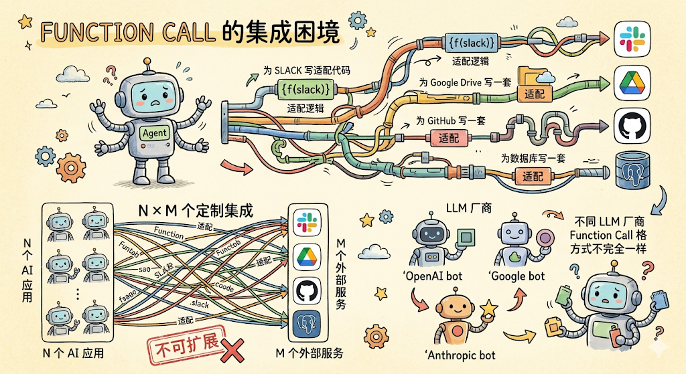
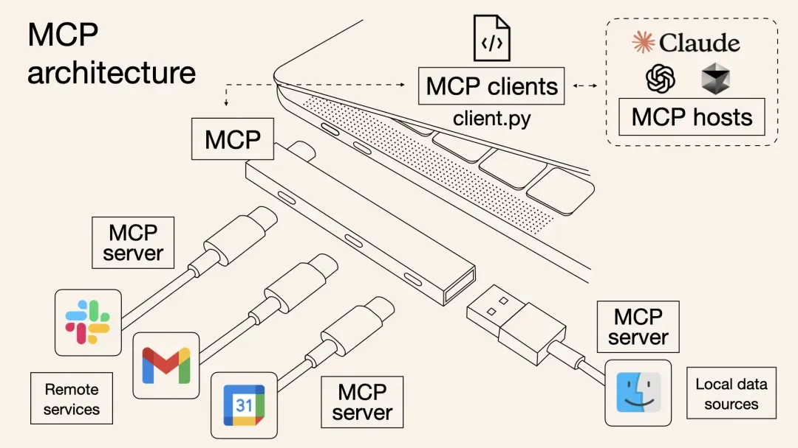

# Function Call、MCP 与 Skills

在 Agent 系统里，function call、MCP 和 skills 经常一起出现，但它们解决的问题不同。

可以先用一句话区分：

```text
Function call = 模型调用工具的动作
MCP = 工具怎么接进来的协议
Skills = 教模型什么时候、怎么使用能力的说明书
```

## Function Call 是什么

Function call 是模型发起的一次工具调用。

模型不只是生成文字，而是决定调用某个外部函数或工具，并按规定格式传参数。

例如：

```text
用户：帮我查一下今天上海天气
```

模型可能生成一次函数调用：

```json
{
  "name": "get_weather",
  "arguments": {
    "city": "上海",
    "date": "today"
  }
}
```

系统真正执行这个函数，拿到天气结果，再交给模型组织成自然语言。

流程是：

```text
用户请求
  -> 模型判断需要工具
  -> 模型生成函数名和参数
  -> 系统执行函数
  -> 函数结果返回模型
  -> 模型基于结果继续回答
```

Function call 关注的是：这一次调用哪个工具，传什么参数。

在代码 Agent 里，搜索文件、读取文件、修改代码、运行命令、查询浏览器、调用 MCP 工具，都可以理解成广义的 function call 或 tool call。

## Function Call 的集成困境

Function call 能让模型调用工具，但如果只靠 function call 直接对接外部服务，很快会遇到集成困境。

假设你开发了一个 Agent，需要它同时连接：

- Slack：发送消息；
- Google Drive：查询文档；
- GitHub：读取代码；
- Postgres：查询数据库。

如果用纯 function call 的方式，就需要为每个服务单独写适配代码：

```text
为 Slack 写一套函数定义和调用逻辑
为 Google Drive 写一套函数定义和调用逻辑
为 GitHub 写一套函数定义和调用逻辑
为 Postgres 写一套函数定义和调用逻辑
```

如果有 N 个 AI 应用，要对接 M 个外部服务，就会变成：

```text
N x M 个定制集成
```

这在实际工程里很难扩展。



更麻烦的是，不同 LLM 厂商的 function call 格式也不完全一样。

例如：

```text
OpenAI
  -> tool_calls

Anthropic
  -> tool_use content block
```

工具调用的消息结构、参数结构、返回格式和流式输出细节都可能不同。

所以 function call 本身解决的是“模型怎么调用一个工具”，但没有解决“海量外部工具如何标准化接入所有 Agent 应用”的问题。

这正是 MCP 想解决的痛点。

## MCP 是什么

MCP 是 Model Context Protocol。

为了解决 function call 的集成困境，Anthropic 在 2024 年 11 月开源了 MCP。

它是一套协议，解决的是：外部工具、数据源、系统，如何标准化接入大模型或 Agent。



可以把 MCP 理解成“AI 界的 USB-C 接口”。

以前，不同手机、电脑和外设各自使用不同接口，非常混乱。USB-C 统一了这件事：一根线可以充电、传数据、接显示器。

MCP 做的是类似的事情：它提供一个统一标准，让不同 AI 应用都能用同一种方式连接外部工具和数据源。

MCP 最核心的价值，是把 `N x M` 的集成问题变成 `N + M` 的问题。

以前是：

```text
N 个 AI 应用
  x
M 个外部服务
  =
N x M 个定制集成
```

现在变成：

```text
N 个 AI 应用各自支持 MCP Client
  +
M 个外部服务各自提供 MCP Server
  =
N + M 个标准集成
```

也就是说：

- 新增一个服务，只需要提供一个 MCP Server，不需要修改所有 AI 应用；
- 新增一个 AI 应用，只需要支持 MCP Client，不需要重新适配所有服务；
- AI 应用和外部服务通过 MCP 协议自动对接。

还有一个关键点：MCP Server 暴露的工具是可发现的。

AI 应用启动或连接时，可以查询：

- 当前有哪些 MCP Server 可用；
- 每个 Server 提供哪些工具；
- 每个工具的用途是什么；
- 每个工具需要哪些参数；
- 返回结果大概是什么结构。

这意味着 Agent 可以在运行时动态发现新能力，而不是只能使用开发者提前写死的函数。

没有 MCP 时，每个工具都要单独适配：

```text
Figma 一套接法
GitHub 一套接法
Jira 一套接法
数据库一套接法
浏览器一套接法
```

有 MCP 后，可以统一成：

```text
Agent
  -> MCP 协议
  -> MCP Server
  -> Figma / GitHub / Jira / 数据库 / 内部系统
```

MCP server 会把自己有哪些工具、参数 schema、资源和能力暴露给 Agent。

Agent 真正使用这些能力时，仍然是发起具体的 function call。

例如 Figma MCP 可以暴露：

```text
get_design_context
get_screenshot
search_design_system
use_figma
```

模型执行设计还原任务时，可能会调用：

```text
get_design_context(fileKey, nodeId)
```

这里 MCP 负责“让 Figma 工具接进来”，function call 负责“此刻调用某个具体工具”。

## Skills 是什么

Skills 是给 Agent 的操作手册或工作流说明。

它通常告诉模型：

- 什么时候触发这个 skill；
- 先读什么；
- 按什么步骤做；
- 哪些工具优先用；
- 哪些文件不能改；
- 怎么验证；
- 遇到错误怎么办。

例如一个 `figma-to-code` skill 可能会写：

```text
当用户给 Figma 链接并要求实现 UI 时：
1. 先读取 Figma 设计上下文
2. 再检查项目组件库
3. 优先复用已有组件
4. 实现后截图比对
5. 不要硬编码不必要的样式
```

Skill 本身不一定是工具。它更像是“教 Agent 做事的方法”。

## 三者区别

可以这样对比：

```text
Function call
  -> 一次具体动作
  -> 调哪个工具、传什么参数

MCP
  -> 工具接入协议
  -> 让外部系统以标准方式暴露工具和资源

Skills
  -> 行为指南 / 工作流
  -> 告诉 Agent 什么时候用哪些工具、怎么完成任务
```

## 三者关系

一个完整 Agent 任务里，它们通常这样配合：

```text
用户任务
  -> Skill 判断工作流
  -> Agent 决定需要工具
  -> 通过 function call 调用工具
  -> 如果工具来自外部系统，可能走 MCP server
  -> 工具返回结果
  -> Agent 继续推理或执行
```

例子：

```text
用户：根据这个 Figma 页面实现代码
```

对应关系：

```text
Skill
  -> figma-to-code skill 告诉 Agent 应该先读设计、再找组件、最后实现和验证

MCP
  -> Figma MCP 提供 get_design_context、get_screenshot 等工具

Function call
  -> Agent 实际调用 get_design_context(fileKey, nodeId)
```

## 一句话总结

```text
Skills 负责“怎么做”
MCP 负责“工具怎么接入”
Function call 负责“现在调用哪个工具”
```

这三者合起来，才让模型从“会说话”变成“能按流程调用工具完成任务”的 Agent。

原文链接：https://mp.weixin.qq.com/s/82Aj1X1SX1-megVaQ1TcCQ
