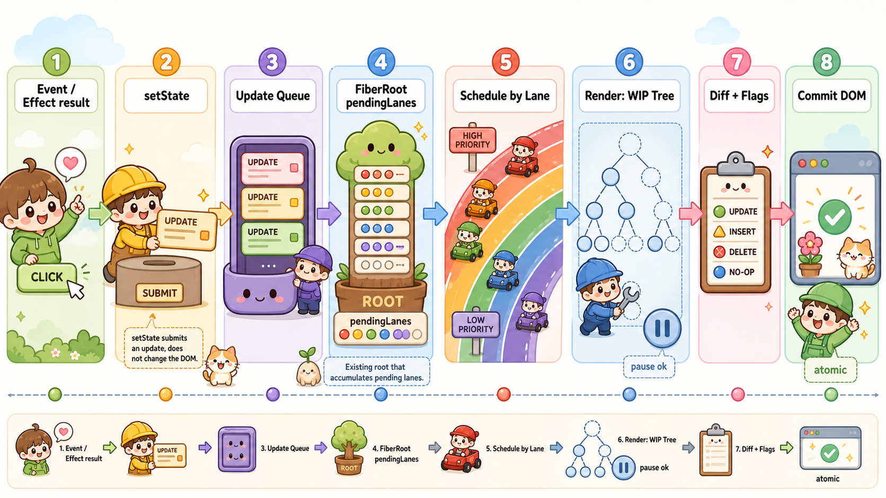

# setState 更新链路

## 问题

`setState` 之后，React 到底做了什么？

它是副作用吗？点击事件是副作用吗？一次更新是不是就创建一个新的 root 去调度？

这些问题容易混在一起，因为它们都出现在一次交互更新里：

```txt
用户点击
  -> 事件回调执行
  -> setState
  -> React 调度更新
  -> render
  -> commit
```

## 结论

`setState` 不是 React 语义里的 effect。

它更准确的角色是：

```txt
向 React 提交一次状态更新的入口
```

`setState` 会创建 update，把 update 挂到对应 Fiber 的更新队列上，再把这次更新的 lane 标记到已有的 FiberRoot 上。之后 React 以 root 为单位调度，从 render 阶段开始计算新的 work-in-progress 树，最后在 commit 阶段把结果提交到 DOM。

点击事件也不等于副作用。点击事件是外部输入，事件处理器里可以做副作用，也可以只是调用 `setState`。

## 点击事件、setState、副作用的边界

点击事件是触发源：

```txt
用户点击按钮
  -> 浏览器派发 click 事件
  -> React 执行 onClick 回调
```

事件处理器里面可以只是提交状态更新：

```jsx
function handleClick() {
  setCount(c => c + 1);
}
```

也可以包含真实副作用：

```jsx
function handleClick() {
  localStorage.setItem('theme', 'dark');
  analytics.track('button_click');
  setCount(c => c + 1);
}
```

这里真正影响 React 渲染系统之外世界的是：

```txt
localStorage.setItem
analytics.track
直接操作 DOM
请求接口
订阅事件
定时器
```

所以可以这样分：

```txt
点击事件：外部输入 / 触发源
事件处理器：响应外部输入的逻辑
setState：向 React 提交状态更新
副作用：修改 React 渲染计算之外的外部世界
```

## 更新链路



一次 `setState` 大致会经历这些步骤：

```txt
setState
  -> 创建 update
  -> 为 update 分配 lane
  -> 把 update 挂到当前 Fiber 的 updateQueue
  -> 从当前 Fiber 向上找到已有的 FiberRoot
  -> 沿途标记 lane / childLanes
  -> 把 lane 合并到 root.pendingLanes
  -> ensureRootIsScheduled(root)
```

注意，这里不是“每次更新都创建一个新的 root”。

root 通常在 `createRoot(container)` 时就已经存在。后续每次 `setState` 只是把这个已有 root 标记为有待处理任务：

```txt
root.pendingLanes = root.pendingLanes | updateLane
```

如果连续触发多个更新：

```jsx
setA(1);
setB(2);
setC(3);
```

它们不一定对应三次独立 render。React 会把更新挂到各自 Fiber 的队列里，再把对应 lane 合并到同一个 root 的 `pendingLanes` 上。

## pendingLanes 和优先级

`root.pendingLanes` 可以同时包含多个优先级的更新。

可以把它粗略理解成一个位图：

```txt
SyncLane | DefaultLane | TransitionLane
```

不同 lane 表示不同优先级或不同批次：

```txt
SyncLane          高优先级，例如点击、输入中的同步更新
InputContinuous  连续输入，例如拖拽、滚动
DefaultLane      普通更新，例如请求回来后的 setState
TransitionLane   startTransition 包裹的低优先级更新
IdleLane         空闲任务
```

调度时，React 不是简单地“一次调度只处理一个 update”，而是：

```txt
从 root.pendingLanes 里选择当前应该处理的一批 nextLanes
```

本轮 render 只处理匹配 `renderLanes` 的 update。其它优先级的 update 不会丢，会留在队列里，等待后续 render。

例如某个组件的队列里有：

```txt
update A: DefaultLane
update B: TransitionLane
update C: DefaultLane
```

如果本轮：

```txt
renderLanes = DefaultLane
```

那么 React 会处理 A 和 C，跳过 B。B 会留到之后处理 `TransitionLane` 时再计算。

## render 阶段发生什么

真正“从根节点往下遍历树，创建 work-in-progress 树，处理更新队列”的过程发生在 render 阶段。

render 阶段从 root 开始：

```txt
createWorkInProgress(root.current)
  -> beginWork 自顶向下处理 Fiber
  -> 处理 updateQueue / hooks queue
  -> 计算新 state
  -> 执行组件函数
  -> diff children
  -> completeWork 自底向上收尾
  -> 得到 finishedWork
```

React 内部会维护两棵树：

```txt
current tree
  已经 commit 到页面上的 Fiber 树

work-in-progress tree
  正在内存中计算的下一棵 Fiber 树
```

它们通过 `alternate` 互相指向：

```txt
currentFiber.alternate === workInProgressFiber
workInProgressFiber.alternate === currentFiber
```

所谓“创建 work-in-progress 树”不一定是每次都创建全新的对象。已有 `alternate` 时，React 会复用旧的 work-in-progress Fiber，并重置本轮需要的字段。

## render 可以中断，commit 不可以

Fiber 把 render 阶段拆成一个个工作单元：

```txt
performUnitOfWork(fiber)
```

每处理完一个 Fiber，React 都可以判断：

```txt
还有时间吗？
有没有更高优先级任务？
要不要先让出主线程？
```

所以在并发渲染下，render 阶段可以处理一半后暂停。

如果低优先级的 transition 正在渲染，此时来了一个高优先级点击更新，React 可以先放下当前 render，回到 root 选择更高优先级的 lane，优先完成用户输入相关更新。

但 commit 阶段不能中断。

因为 commit 阶段会真正修改 DOM、更新 ref、执行 layout effect。如果提交到一半被打断，页面可能出现一半新状态、一半旧状态的不一致 UI。

所以：

```txt
render 阶段：内存计算，可以暂停、重做、丢弃
commit 阶段：修改真实世界，必须一次性完成
```

## 和 useEffect 的关系

`useEffect` 是 commit 之后执行的 passive effect。

如果 effect 里调用 `setState`：

```jsx
useEffect(() => {
  fetchUser().then(user => {
    setUser(user);
  });
}, []);
```

这里可以理解成：

```txt
副作用：请求接口
副作用结果：user
setState：把 user 作为状态更新提交给 React
React：触发下一轮 render / commit
```

但不是所有 `setState` 都来自副作用结果。它也可以来自点击、输入、定时器、父子组件协作等。

更稳的表达是：

```txt
setState 是提交状态变化意图的方式。
这个状态变化可能来自副作用结果，也可能来自用户事件。
```

## 记忆方式

可以把 `setState` 理解成“递交工单”：

```txt
它不会直接改 DOM
它只是把 update 递交给 React
```

可以把 `root.pendingLanes` 理解成“任务看板”：

```txt
同一个 root 上可以挂很多不同优先级的任务
React 每次挑当前最该做的一批任务处理
```

可以把 render 阶段理解成“打草稿”：

```txt
在内存里算新 UI
可以暂停、重算、丢弃
```

可以把 commit 阶段理解成“发布上线”：

```txt
真正改 DOM
不能只发布一半
```

最终链路就是：

```txt
外部输入 / 副作用结果 / 业务逻辑
  -> setState
  -> updateQueue
  -> root.pendingLanes
  -> 按 lane 调度
  -> render 阶段计算 work-in-progress 树
  -> diff 并收集 flags
  -> commit 阶段提交 DOM 和 effect
```
